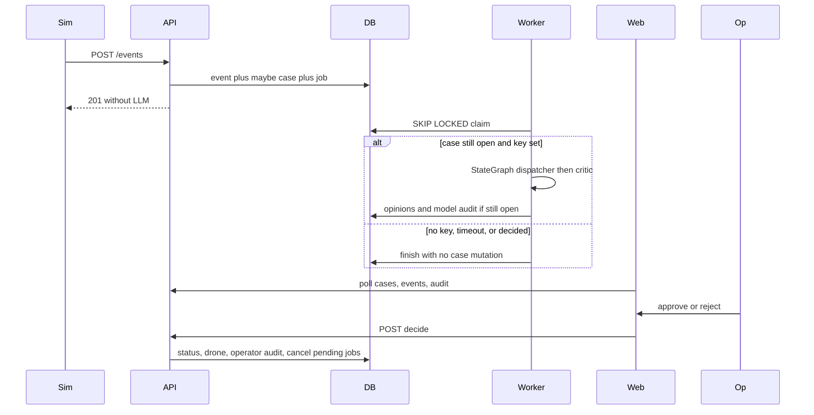
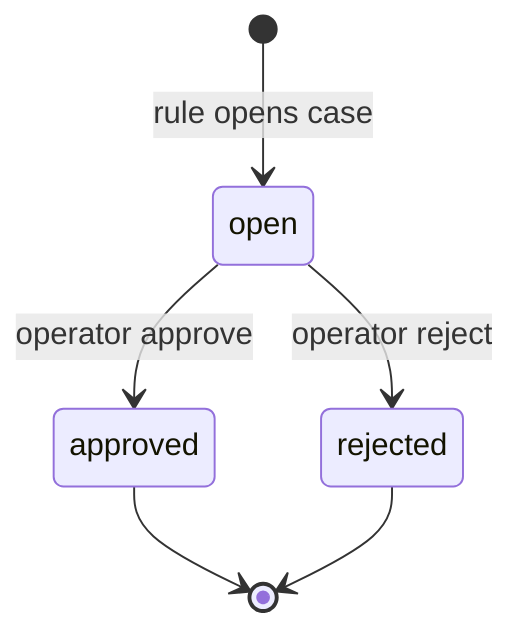
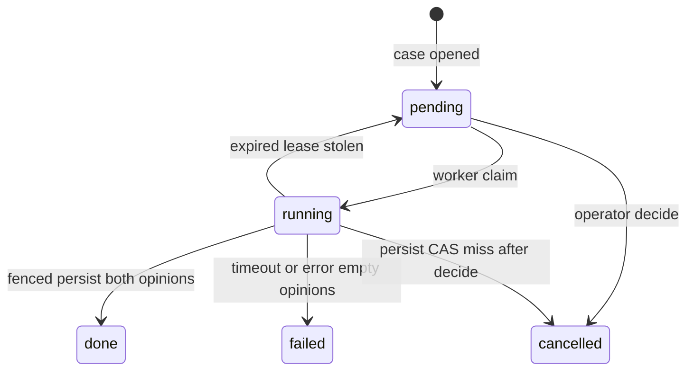

# v1 duty desk first cut - Plan

## Goal Capsule

- **Objective:** Grow the MVP duty loop into the first v1 cut: three traffic facts on segment A, a Postgres job so ingest does not wait on the model, two named opinions on the case (dispatcher then critic), markdown playbook search, readable audit of operator and model/tool calls.
- **Authority:** `docs/scope/02-v1.md` for horizon identity; ADR 0002 (human-gated drone), 0003 (stack), 0006 (tests without TDD on this cut), 0007 (orval). This file is the execution contract for the first cut only. Product horizon docs stay in `docs/`; this artifact lives under `.compound-engineering/artifacts/plans/`.
- **Execution profile:** Deep. Named tests with each unit. Not red-first until a later mid-v1 TDD choice. One unit at a time; the CTO names the next unit. Before adding Python packages, wait for explicit CTO ok.
- **Stop if:** a fly/approve/reject/close-road tool appears; Redis/Celery/Kafka/map/third role/resident line/drone photo enter the diff; ingest waits on the model again; the console becomes a chat.
- **Tail ownership:** Parent chat executes named units. Do not mark `docs/plans/01-mvp.md` status. Do not create `docs/plans/02-v1.md` from this file unless the CTO asks.

## Product Contract

### Summary

First v1 cut of the same desk: tape of crash-drop, speeding, and jam on segment A; a code rule still opens at most one open case with no LLM key; a worker later fills dispatcher and critic opinions from a StateGraph plus playbook files; the operator still sends or dismisses the drone. Not the whole of `docs/scope/02-v1.md`.

### Problem Frame

The duty minute is still: facts arrive, something is worth a case, a human gates the dangerous step. MVP blocks ingest on the optional model call and has one rationale string, so a second voice and a slow LLM fight the tape. This cut separates ingest from the model and puts two opinions plus audit on the same case card.

### Key Decisions

- Two in-product model roles now: dispatcher then critic, one pass each, both always run. Traffic role later. `(session-settled: user-directed — chosen over dispatcher-only and over three roles now: second voice visible before adding traffic)` Governs R7, R8.
- Playbook is a few markdown files the model may search. `(session-settled: user-approved — chosen over skipping playbook in this cut: model must not invent procedure from nothing)` Governs R11.
- Resident text line and drone photo/vision are out of this plan. `(session-settled: user-directed — chosen over including both in this plan: keep the cut on roles, queue, and playbook)` Governs scope boundaries.
- Tests ship with units; TDD (red-first) does not start on U1. `(session-settled: user-directed — chosen over TDD from the first unit: maybe mid-v1)` Governs execution notes.

### Requirements

**Ingest and rules**

- R1. `POST /events` stays idempotent on `event_id` and returns without waiting on the model.
- R2. Events on segment A carry a kind: `crash_drop`, `speeding`, or `jam`.
- R3. A code rule may open at most one `open` case per segment across all kinds, with no LLM key.
- R4. Opening thresholds are named tunable constants in API code. Starter values live in KTD8. Copy and numbers are not ADR-level.

**Queue and worker**

- R5. Opening a case inserts at most one job in the same database transaction as the case.
- R6. A worker process outside the API HTTP request claims jobs and runs the model graph.

**Opinions and fallback**

- R7. Dispatcher and critic each persist a named opinion on the same case. One pass each. No debate loop.
- R8. No API key or model timeout: opinions stay empty, the card has no confident model flight proposal, approve and reject still work.

**HITL**

- R9. Only the operator may approve or reject. The model has no fly, approve, reject, or close-road tool. Application code changes `drone_status` after approve. Per ADR 0002.
- R10. If the operator decides while a job is queued or running, leftover work must not write opinions or change drone status.

**Playbook, audit, console, sim**

- R11. The model may search markdown playbook files in-repo. File substring search only.
- R12. Operator approve/reject and model/tool calls are stored as audit rows the console can read.
- R13. Console stays list, card, two buttons. The card shows both opinions and audit. Console HTTP types come from orval per ADR 0007.
- R14. The simulator can post crash_drop, speeding, and jam sequences over HTTP only.

### Actors

- A1. Duty operator — sees tape, card, two opinions, audit; presses approve or reject.
- A2. Simulator — posts events; never talks to the DB.
- A3. In-product model — dispatcher and critic; writes opinions; cannot fly.
- A4. Job worker — same app package, separate process.

### Key Flows

- F1. Ingest opens a case
  - **Trigger:** `POST /events` with a new `event_id` on A.
  - **Actors:** A2, API
  - **Steps:** Persist event. Maybe open one case. Enqueue one job in that transaction. Return without LLM.
  - **Outcome:** Tape grew. At most one `open` case. Job pending if a case opened.
  - **Covered by:** R1, R2, R3, R5
- F2. Worker fills opinions
  - **Trigger:** Worker claims a pending job.
  - **Actors:** A4, A3
  - **Steps:** If no key, finish with empty opinions. Else run dispatcher then critic with playbook search. Persist opinions only while case is `open`. Audit tool/model calls.
  - **Outcome:** Card can show two voices, or rule-only empty opinions.
  - **Covered by:** R6, R7, R8, R11, R12
- F3. Operator decides
  - **Trigger:** Approve or reject on an `open` case, with or without opinions.
  - **Actors:** A1
  - **Steps:** Application code sets case status and drone status. Operator audit row. Pending jobs for that case cancelled. In-flight job persist is refused.
  - **Outcome:** Drone stub on approve; idle on reject. Model did not fly.
  - **Covered by:** R9, R10, R12, R13
- F4. Second kind while open
  - **Trigger:** Another kind arrives on A while a case is `open`.
  - **Steps:** Persist the event. Do not open a second case or job.
  - **Covered by:** R2, R3

### Acceptance Examples

- AE1. Duplicate `event_id` yields one event row and at most one case and one job. Covers R1, R5.
- AE2. Collapse sequence with unset `LLM_API_KEY` opens an approvable case and returns before any model work. Covers R1, R3, R8.
- AE3. Speeding and jam sequences each can open a case when none is open. Covers R2, R3, R14.
- AE4. With a key, worker writes dispatcher then critic opinions; card shows both. Covers R7, R13.
- AE5. Model timeout leaves opinions empty and the case approvable. Covers R8.
- AE6. Approve while a job is running sets drone status; leftover job does not write opinions. Covers R9, R10.
- AE7. Graph tool list cannot fly, approve, reject, or close a road. Covers R9.
- AE8. `GET` audit for a decided case includes the operator action and any prior model/tool rows. Covers R12.

### Success Criteria

Compose up. Worker running. Sim posts a mixed tape. Console shows list, card, two buttons, two opinion slots, audit. Reject leaves drone idle. Approve changes drone status. Loop still runs with no model key.

### Scope Boundaries

**In this plan**

- Event kinds, Postgres jobs, worker process, two opinions, playbook files, audit read, orval card update, sim kinds, Compose/Makefile worker.

**Deferred to follow-up**

- Traffic role (third voice).
- Resident text line.
- Stub drone frame and vision.
- TDD on the API loop (maybe mid-v1).
- LangGraph Postgres checkpointer / mid-graph resume.
- pgvector.
- False-alarm vs real multi-minute sim polish beyond the three kind tapes.

**Outside this product's identity**

- Map, Kafka, Redis, Celery, Kubernetes, drone fleet, resident portal, closing a real road, chat UI, `fly()` as a model tool.

## Planning Contract

### Key Technical Decisions

- KTD1. Postgres job table claimed with `SELECT … FOR UPDATE SKIP LOCKED`, not Redis or Celery. `(session-settled: user-directed — chosen over Redis: v1 volume does not justify a second store)` Instantiates R5, R6. Enqueue in the same transaction as case insert. `UNIQUE (jobs.case_id)` — one row per case; retry updates that row. Claim in a short transaction: `pending` or (`running` and expired lease); bump `lease_version` and `attempts`; commit before the graph. Complete in a later short transaction: `UPDATE jobs … WHERE id=:job AND lease_version=:claimed AND status='running'` in the same transaction as the case CAS in KTD5. Reaper is this steal in U3, not a later unit and not Redis.
- KTD2. LangGraph `StateGraph` with nodes dispatcher then critic. Pin `langgraph==1.2.11` (needs CTO ok before install). Do not use `create_react_agent` / `create_agent`, `interrupt()`, or a Postgres checkpointer in this cut. Do not bind a `fly` tool that returns rejected. Bound names are the allowlist. Instantiates R6, R7, R9.
- KTD3. Two nullable text columns on `cases`: `dispatcher_opinion`, `critic_opinion`. Stop exposing `rationale` on the console API. Keep the `rationale` column unused for one migration cycle. Do not dual-write `rationale`. Instantiates R7.
- KTD4. Case `status` stays `open | approved | rejected`. `drone_status` stays `idle | in_flight | on_site`. Map v1 words onto these fields: waiting-on-human = `open`; drone-in-flight = `drone_status`; closed = approved or rejected. Instantiates R9.
- KTD5. Decide: `UPDATE cases … WHERE id=:id AND status='open'`; zero rows → 409. Same transaction: operator audit and cancel `pending` jobs only. Do not cancel `running` from decide. Persist: `write_opinion` updates graph state only. After the graph returns, one transaction writes both opinion columns (or neither), model/tool audit, and the job terminal status, with KTD1 fencing plus `WHERE cases.status='open'`. Zero case rows → job `cancelled`, no opinions, no drone change. Instantiates R10, R7.
- KTD6. `GET /cases/{id}/audit` returns append-only `{id, actor, action, why, created_at}`. Operator actor stays `AUDIT_ACTOR`. Model/tool actors are `dispatcher`, `critic`, or `tool:<name>`. Model/tool rows only in the fenced persist transaction. Instantiates R12.
- KTD7. Playbooks live in `apps/api/playbooks/*.md`. Tool `search_playbook` is case-insensitive substring over filename and body, top 3 chunks, max 500 characters each. Instantiates R11.
- KTD8. Starter rule constants (tunable, not ADR): `crash_drop` = last two samples, previous speed > 0 and current ≤ 0.5 (today’s collapse). `speeding` = last sample ≥ 80. `jam` = last three samples all ≤ 5 and at least one of the previous three > 5. Kind is stored on the event; `trigger_kind` on the case records which rule opened it (nullable until U2). Instantiates R2, R4.
- KTD9. Confident model proposal means both opinion columns are non-null after a fenced persist with a key. Not `jobs.status=done`. The approve button stays enabled on every `open` case (ADR 0002). Instantiates R8, R9.
- KTD10. Worker entry is `python -m app.worker` (`apps/api/app/worker.py` thin `__main__`, loop in `apps/api/app/jobs/`). Compose `worker` service and `make worker`. Not FastAPI `BackgroundTasks`. Instantiates R6.
- KTD11. Job statuses: `pending`, `running`, `done`, `failed`, `cancelled`. Terminal: done, failed, cancelled. Check constraint on those strings. Instantiates R5, R6.
- KTD12. The API process does not import the LangGraph runtime and does not read `LLM_API_KEY` to fill the card. Only the worker reads the key. Instantiates R1.

### High-Level Technical Design

Drone status is orthogonal on the case row: idle until approve, then in_flight then on_site in application code.

Job states never move `cases.status` or `drone_status`. Per KTD5, persist is both opinion columns or neither.

### System-Wide Impact

- Two processes, one package: HTTP (`uvicorn app.main:app`) and worker (`python -m app.worker`).
- API may ingest, open a case, enqueue, approve/reject, and run `dispatch_after_approve`. It must not import the graph or fill opinions.
- Worker may claim jobs, run the graph, and persist opinions plus model/tool audit. It must not import `app.drone.service` or call approve/reject.
- `POST /events` may add `kind`. Duplicate event must not create a second job. Worker down must not 5xx ingest. `/health` stays a Postgres ping.
- `GET /events` includes `kind` so the tape is honest (F4). Do not expose job or lease fields on console DTOs.
- `GET /cases` drops `rationale` and adds the two opinion fields in U6 with `make openapi` in that same unit.
- `GET /cases/{id}/audit` is new. Jobs have no HTTP API.
- Dangerous effect is changing `status` / `drone_status`, not a string named `fly`.
- Pre-v1 open cases are not backfilled with jobs. They stay approvable and jobless.

### Risks and Dependencies

- HITL vs in-flight job: decide uses KTD5; persist uses KTD1 fencing. Mitigation: tests in U3 that claim, then approve, then persist.
- Two open cases on one segment: Python-only today. Mitigation: partial unique on `cases(segment) WHERE status='open'` in U1; savepoint around case+job in U3 so a unique miss does not roll back the event.
- Stuck `running` without steal: dead worker leaves a permanent running row. Mitigation: expired-lease claim in U3.
- MVP rows on migrate: `events.kind` default `crash_drop`; `trigger_kind` nullable; do not drop `rationale`.
- Package pin `langgraph==1.2.11` needs CTO ok before U5. Do not add Redis, Celery, or checkpoint-postgres.
- Lease/reaper is a hole inside the Postgres queue, not a reason to switch stores. KTD1 stays.

### Assumptions

- Threshold numbers in KTD8 are starters, same class as today’s collapse constant.
- Critic always runs after dispatcher in this cut (two voices visible). Not “critic only on disagreement.”
- No LangGraph checkpointer tables.
- One job row per case for this cut. One worker is enough for the demo.
- Approve with empty opinions still runs the drone stub.
- Critic timeout clears both opinions (KTD5 both-or-neither).

### Open Questions

- Deferred: TDD on the API loop, maybe mid-v1. Not blocking this plan.
- Deferred: final card copy for empty opinions. Starter: rule opened the case, no model proposal.
- Deferred: whether GET /events kind column is shown as a chip or raw string. Product: kind is on the payload.

### Product Contract preservation

Product Contract unchanged after bootstrap. No upstream requirements-only unified plan.

### Implementation constraints

- Modular monolith folders under `apps/api/app/`. New `jobs/` folder. Do not add a microservice.
- After any API schema change: `make openapi` and commit `apps/web/openapi.json` plus `apps/web/src/api/generated/`.
- One Python venv: `apps/api/.venv`. Sim stays stdlib.
- `apps/api/tests/conftest.py` truncate order must include `jobs` before `cases`.
- Do not install packages until the CTO says ok.

### Sequencing

U1 schema → U2 rules and U3 queue can proceed after U1 (U3 must not wait on U2). U4 playbook after U1. U5 graph after U3 and U4. U6 console after U1 and KTD6 (can land before U5 with empty opinions). U7 run path after U3 (worker) and U2 (kinds on the tape).

### Sources and Research

- Local: `apps/api/app/events/service.py` still calls `maybe_fill_rationale` on ingest. `cases.rationale` is a single string. Audit is write-only. No worker in Compose. ADR 0007 orval path.
- External (load-bearing): LangGraph 1.2.11 StateGraph; node timeouts need ≥1.2 and async nodes; do not use `interrupt()` for operator HITL; FastAPI BackgroundTasks is the wrong place for the graph; Postgres `SKIP LOCKED` plus a lease/reaper; `langgraph-checkpoint-postgres` not used in this cut.
- CE learnings corpus is empty.

## Implementation Units

GitHub issues are an index. Status stays in this file.

| Unit | Issue |
|------|-------|
| U1 | [#3](https://github.com/happylolonly/smart-city-os/issues/3) |
| U2 | [#2](https://github.com/happylolonly/smart-city-os/issues/2) |
| U3 | [#4](https://github.com/happylolonly/smart-city-os/issues/4) |
| U4 | [#5](https://github.com/happylolonly/smart-city-os/issues/5) |
| U5 | [#6](https://github.com/happylolonly/smart-city-os/issues/6) |
| U6 | not opened — say so before writing this unit; do not open unasked |
| U7 | not opened — say so before writing this unit; do not open unasked |

Parent cut: [#1](https://github.com/happylolonly/smart-city-os/issues/1). Unit commits end with `Closes #n`. Push to `main` only after the CTO accepts the unit and Status is marked here; that push closes the issue.

### U1. Schema for kinds, jobs, and opinions

- **Goal:** Persist event kind, job rows, two opinion columns, and `trigger_kind` so later units do not fight the MVP schema.
- **Requirements:** R2, R3, R5, R7
- **Dependencies:** none
- **Files:**
  - `apps/api/app/models.py`
  - `apps/api/alembic/versions/0003_v1_kinds_jobs_opinions.py` (next revision after `0002_case_rationale`)
  - `apps/api/tests/conftest.py`
  - `apps/api/tests/test_schema_v1.py`
- **Approach:**
  1. Add `events.kind` NOT NULL with server default `crash_drop`. Do not drop `rationale`.
  2. Add nullable `cases.trigger_kind`, plus `dispatcher_opinion` and `critic_opinion`. Do not backfill jobs for existing open cases.
  3. Add `jobs` per KTD1 and KTD11. `UNIQUE (case_id)`. Status CHECK per KTD11. FK without ON DELETE CASCADE.
  4. Partial unique on `cases(segment) WHERE status='open'`.
  5. Truncate `jobs` before `cases` in tests.
- **Patterns to follow:** Alembic `000N_short_snake`; string status constants in the owning module, not enums.
- **Test scenarios:**
  - Happy: migrate; new columns exist; one job insert for a case succeeds; `rationale` column remains.
  - Happy: a pre-0003 event row migrates with `kind=crash_drop`; an old case has null `trigger_kind` and no job.
  - Edge: second job for the same `case_id` is rejected, including after `done`.
  - Edge: two `open` cases on one segment are rejected.
  - Error: missing FK `case_id` fails.
- **Verification:** `make migrate` then `make test-api` includes the new schema test.

### U2. Event kinds and opening rules

- **Goal:** Speeding and jam can open a case by code rule. Collapse still works. At most one open case per segment across kinds.
- **Requirements:** R2, R3, R4
- **Dependencies:** U1
- **Files:**
  - `apps/api/app/events/schemas.py`
  - `apps/api/app/events/service.py`
  - `apps/api/app/cases/service.py`
  - `apps/api/tests/test_ingest.py`
  - `apps/api/tests/test_event_kinds.py`
- **Approach:**
  1. Accept `kind` on `EventIn` with the three values. Default `crash_drop` if omitted so old sim clients still work.
  2. Keep collapse for `crash_drop`. Add speeding and jam using KTD8 constants.
  3. If an `open` case exists for the segment, persist the event and return without a new case.
  4. Do not call the model. Job enqueue is U3.
- **Patterns to follow:** `maybe_open_on_collapse` and `test_ingest.py` collapse sequence.
- **Test scenarios:**
  - Happy: crash_drop collapse opens one case with `trigger_kind=crash_drop`. Covers AE3.
  - Happy: last sample ≥ 80 with kind speeding opens a case when none is open.
  - Happy: jam window per KTD8 opens a case when none is open.
  - Edge: speeding event while an open crash case exists stores the event and does not open a second case. Covers F4.
  - Error: unknown kind is 422.
- **Verification:** ingest tests green without LLM key.

### U3. Job enqueue, worker stub, ingest off the model path

- **Goal:** Case open enqueues a job. HTTP ingest never calls the LLM. A worker can claim and complete a stub job. Decide cancels leftover work per KTD5.
- **Requirements:** R1, R5, R6, R10
- **Dependencies:** U1
- **Files:**
  - `apps/api/app/events/service.py`
  - `apps/api/app/jobs/service.py`
  - `apps/api/app/jobs/` (claim and complete)
  - `apps/api/app/worker.py`
  - `apps/api/app/cases/service.py`
  - `apps/api/tests/test_jobs.py`
  - `apps/api/tests/test_llm_stub.py`
  - `apps/api/tests/test_hitl.py`
- **Approach:**
  1. Remove `maybe_fill_rationale` from `ingest_event`. Per KTD12 the API must not fill opinions.
  2. When a case is created, insert a `pending` job in the same commit. Use a savepoint around case+job so a unique miss does not roll back the event.
  3. Duplicate `event_id` does not insert a second job.
  4. Worker: KTD1 claim (including expired `running`). No key while still `open` → job `done`, empty opinions. Stub persist uses KTD5 both-or-neither. Graph is U5.
  5. Approve/reject: KTD5 SQL CAS, 409 on zero rows, cancel `pending` only.
- **Execution note:** Named tests with the unit. Not red-first. Lease steal lands here, not in U5.
- **Patterns to follow:** ingest idempotency (`IntegrityError` then re-select). HITL 404/409.
- **Test scenarios:**
  - Happy: collapse ingest returns before any model; a job row exists. Covers AE1, AE2.
  - Happy: worker with unset key finishes `done` with null opinions; case remains approvable. Covers AE2.
  - Happy: `LLM_API_KEY` set on the API process still leaves opinions null on `POST /events`. Covers KTD12.
  - Edge: two workers, one job; expired lease steal bumps `lease_version`; stale complete is a no-op.
  - Error: claim, then approve, then persist — opinions stay null; drone follows the operator; job does not end `done` with opinions. Covers AE6.
  - Error: second concurrent decide is 409 via SQL CAS.
- **Verification:** `test_llm_stub.py` proves ingest does not fill the card. `test_jobs.py` proves enqueue, steal, and leftover persist.

### U4. Playbook files and search tool

- **Goal:** Deterministic playbook search the graph can call.
- **Requirements:** R11
- **Dependencies:** U1
- **Files:**
  - `apps/api/playbooks/crash-look.md`
  - `apps/api/playbooks/speeding.md`
  - `apps/api/playbooks/jam.md`
  - `apps/api/app/llm/playbook.py`
  - `apps/api/tests/test_playbook.py`
- **Approach:**
  1. Three short markdown pages: crash → propose a look, not a road close; speeding → look optional; jam → look optional, no flight required.
  2. Implement KTD7 as a plain function, not an HTTP route.
  3. Missing directory or empty hits returns `[]` without raising.
- **Test scenarios:**
  - Happy: query matching a heading returns that file’s chunk.
  - Edge: no match returns empty list.
  - Error: missing playbooks dir returns empty list, no crash.
- **Verification:** `test_playbook.py` does not need Postgres if search is pure files; if it uses settings paths, keep it in pytest with the rest.

### U5. StateGraph dispatcher and critic

- **Goal:** Worker runs a two-node graph with allowlisted tools, timeouts, and model/tool audit.
- **Requirements:** R6, R7, R8, R9, R11, R12
- **Dependencies:** U3, U4
- **Files:**
  - `apps/api/pyproject.toml` (after CTO ok)
  - `apps/api/app/llm/` (graph, tools, replace inline stub)
  - `apps/api/app/jobs/`
  - `apps/api/app/worker.py`
  - `apps/api/app/audit/service.py`
  - `apps/api/tests/test_agents.py`
  - `apps/api/tests/test_llm_stub.py`
- **Approach:**
  1. Ask CTO, then pin `langgraph==1.2.11`. Do not add Redis, Celery, or `langgraph-checkpoint-postgres`.
  2. Tools: `read_recent_events`, `read_case`, `search_playbook`, `write_opinion(role, text)`. Bind different tool lists per node. Never register fly/approve/reject.
  3. Async nodes with a timeout. On timeout or missing key: both opinion columns stay null per KTD5. Do not retry timeout into a late confident proposal.
  4. Persist after the graph returns, via KTD5. Do not commit opinions from a tool mid-graph.
  5. Compile the graph once per worker process.
- **Execution note:** Fake/stub the chat model in tests. Do not call a live provider in CI.
- **Patterns to follow:** today’s `read_recent_events` / `write_draft` as the allowlist seed.
- **Test scenarios:**
  - Happy: stubbed LLM writes dispatcher then critic; both columns set; playbook search audited. Covers AE4, AE8.
  - Happy: unset key skips graph; opinions null; case approvable. Covers AE2, AE5.
  - Error: timeout path leaves opinions null and case approvable. Covers AE5.
  - Error: allowlist — invoking fly is impossible / rejected. Covers AE7.
  - Integration: case already approved → job does not write. Covers AE6.
- **Verification:** `test_agents.py` plus existing HITL tests.

### U6. Console opinions, audit, orval

- **Goal:** Card shows two opinions and audit. Buttons still only on `open`.
- **Requirements:** R12, R13
- **Dependencies:** U1
- **Files:**
  - `apps/api/app/cases/schemas.py`
  - `apps/api/app/cases/router.py`
  - `apps/api/app/audit/` (read)
  - `apps/api/tests/test_console_reads.py`
  - `apps/web/openapi.json`
  - `apps/web/src/api/generated/**`
  - `apps/web/src/features/cases/CaseCard/`
  - `apps/web/src/features/cases/domain.ts`
  - `apps/web/src/features/cases/CaseCard/CaseCard.test.tsx`
- **Approach:**
  1. Named Pydantic models for case list item (two opinions, no `rationale`) and audit list.
  2. `GET /cases/{id}/audit` per KTD6.
  3. `make openapi`.
  4. Card: two opinion blocks; empty state copy for rule-only; audit list; two buttons unchanged.
  5. Poll: keep 2s cases/events; fetch audit for the selected case.
- **Patterns to follow:** orval hooks only; `CaseCard.test.tsx` button contract.
- **Test scenarios:**
  - Happy: API list payload includes both opinion fields. Covers R13.
  - Happy: audit GET after approve includes operator row. Covers AE8.
  - Edge: null opinions render rule fallback copy; buttons enabled if status is open.
  - Integration: card test — approve/reject still fire the generated mutations.
- **Verification:** `make test-api` and `pnpm test` in `apps/web`. Manual: after sim, card shows slots and buttons.

### U7. Simulator kinds, worker run path, ADR

- **Goal:** Documented demo path runs api, worker, web, postgres, and a mixed tape. Lock the first-cut choices in an ADR.
- **Requirements:** R6, R14
- **Dependencies:** U2, U3
- **Files:**
  - `apps/sim/tape.py`
  - `apps/sim/run.py`
  - `apps/sim/tests/test_tape.py`
  - `docker-compose.yml`
  - `Makefile`
  - `README.md`
  - `.env.example`
  - `docs/adr/0008-v1-first-cut.md`
  - `docs/adr/README.md`
- **Approach:**
  1. Tape covers crash_drop (existing), plus short speeding and jam sequences. HTTP only.
  2. Compose `worker` service. `make worker`. README: migrate, up, worker, sim, open console.
  3. ADR 0008: two roles, Postgres jobs, playbook files, no GraphInterrupt, no Redis. Point at this plan for units.
- **Test scenarios:**
  - Happy: canned tapes include a collapse, a speeding open, and a jam open (predicates, not live HTTP). Covers R14.
  - Test expectation: none for Compose itself — documented run path, same as MVP U7.
- **Verification:** README path can be followed: up → worker → sim → card → yes/no → audit row.

## Verification Contract

| Gate | Command | Proves |
|------|---------|--------|
| API tests | `make test-api` | R1–R12, AE1–AE8 as units land |
| Web tests | `pnpm test` in `apps/web` | R13 card buttons and empty opinions |
| Sim predicates | `python -m pytest apps/sim/tests/test_tape.py` | R14 tapes |
| OpenAPI | `make openapi` after schema/router changes | ADR 0007 |
| Demo | Compose api+worker+web+postgres, then sim | Success criteria |

No live LLM in CI. Do not add `release:validate`.

## Definition of Done

**Global**

- All units U1–U7 landed or explicitly deferred by the CTO.
- Ingest does not call the model on the request path.
- No fly tool. No Redis. No third role. No resident line. No drone photo.
- Abandoned experiment code is not in the diff.
- Orval dump and generated client committed with API changes.

**Per unit**

- U1: migration applies on a clean DB; schema test green.
- U2: three kinds can open; second kind does not double-open.
- U3: job row on case open; no-key worker; expired-lease steal; leftover persist is a no-op.
- U4: playbook search tests green.
- U5: two opinions from stubbed graph; timeout/no-key fallback; allowlist test.
- U6: card shows two opinions and audit; buttons on `open` only.
- U7: README run path includes worker; ADR 0008 accepted in `docs/adr/README.md`.

## Appendix

### Research notes that shaped KTDs

LangGraph 1.2.x node `timeout=` requires async nodes. FastAPI BackgroundTasks is documented as the wrong place for heavy work. Postgres SKIP LOCKED is the claim primitive, not a full queue product — lease and reaper are required once the graph can exceed the lock time. Context7’s LangGraph index lagged 1.2.11; pins came from PyPI (2026-09-16).
