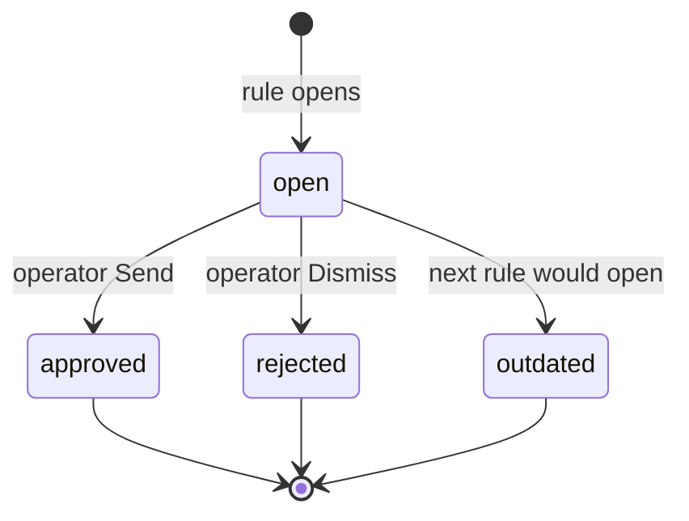
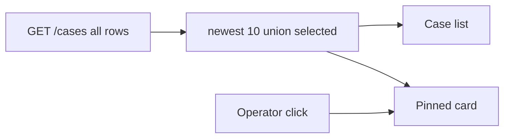

# Live shift desk - Plan

## Goal Capsule

- **Objective:** Turn the duty desk into a usable live shift on segment A: a continuous unique incident stream, one `open` case at a time, `outdated` when the next incident opens, kind on the list and card, newest cases on top, about ten on screen plus the selected row if it aged off.
- **Authority:** `docs/scope/02-v1.md` for horizon identity. The first duty-desk cut [`.compound-engineering/artifacts/plans/2026-09-16-001-feat-v1-duty-desk-cut-plan.md`](2026-09-16-001-feat-v1-duty-desk-cut-plan.md) stays the record of V1-U1–V1-U7. This file is the execution contract for the next named cut only. Do not rewrite that plan’s completed units as if they always had a live stream or `outdated`. ADR 0002 still owns human-gated drone. No new ADR in this cut.
- **Execution profile:** Standard. Named tests with each feature-bearing unit. Occupancy (U1) may go test-first on the API loop; other units ship named tests without red-first. Parent chat runs **one unit at a time**. Do not open a GitHub issue until the CTO names the cut. Do not start a unit that has no issue once the cut is named.
- **Stop if:** a second `open` lands on segment A; a miss is written as operator `rejected`; Send flies after `outdated`; the card auto-jumps to a new open; Last speeds gains a kind column; MIXED_TAPE becomes the live loop; the first-cut plan’s done units or KTD4 are rewritten; ADR 0002 is edited in place; Kafka/map/microservices/DDD split enter the diff.
- **Tail ownership:** Parent chat executes named units. This file holds status. Horizon copy in `docs/scope/02-v1.md` updates in U5 of this cut, not by editing the first-cut plan.

## Product Contract

### Summary

The desk runs a live shift: the simulator keeps posting new incidents until the operator stops it, the operator still gates the drone, and a missed case becomes `outdated` instead of blocking the road. Kind is visible on the list and card. The screen shows recent cases, not the whole history.

### Problem Frame

The first v1 cut is a one-shot mixed tape. Collapse occupies the only `open` slot, later kinds still land on the speed tape, and the card does not show kind. After the tape ends, the desk looks live but nothing new can happen. That is unusable as a shift, not a small sim bug.

### Key Decisions

- Occupancy stays one `open` per segment. A miss is a fourth status `outdated`, not a fake operator reject and not a queue of several `open` cases. `(session-settled: user-directed — chosen over system-reject and over several open cases: miss must be honest and the road stays one incident)` Governs R3, R5, R6.
- Displacement happens as soon as a new rule would open a case. No grace window. `(session-settled: user-directed — instant displace chosen over a 20s hold: a new matching incident must be able to open immediately)` Governs R4, R5.
- The open card does not jump to the new case. Buttons on the displaced case disable even if that card is still selected. `(session-settled: user-directed — chosen over auto-jumping the card: the operator keeps the row they are reading)` Governs R8, R9.
- The simulator is an endless unique incident stream, not a loop of the canned mixed tape and not a single finite run. `(session-settled: user-directed — chosen over looping MIXED_TAPE and over one longer tape: the desk must stay alive until stopped)` Governs R1, R2.
- The console list shows the newest ~10 cases, plus the selected row if it aged off that window. Older unselected rows stay in the store. `(session-settled: user-approved — chosen over full history on screen and over open-plus-two: tune after the first live shift)` Governs R10.
- Kind appears on the case list and card. Last speeds does not gain a kind column in this cut. `(session-settled: user-directed — chosen over kind on the speed tape and over skipping kind: the card must say which incident it is)` Governs R11, R12.

### How This Work Fits Together

<!-- ce-section: work-relationships -->

This plan owns the **live shift desk**: continuous incidents, `outdated`, recent list, kind on list/card. The first duty-desk cut is done history, not a file to reverse in place.

- First cut V1-U1–V1-U7 ([`2026-09-16-001-feat-v1-duty-desk-cut-plan.md`](2026-09-16-001-feat-v1-duty-desk-cut-plan.md)) — **Depends on** that cut already shipped (rules, worker, opinions, audit, one-open unique, canned MIXED_TAPE demo). This cut **supersedes** that plan’s occupancy KTD (`open | approved | rejected` only) and the one-shot mixed-tape demo path for the next named units. Do not edit those completed unit sections to pretend they included `outdated`.
- Horizon `docs/scope/02-v1.md` — **Shares** the short-shift identity. U5 updates that file’s “Done enough” and “explicit case states” so horizon text matches the live stream and `outdated`. Not a silent rewrite of the first cut.
- ADR — **No new ADR this cut.** Fourth status is a plan occupancy KTD plus horizon copy. Do not edit ADR 0002. Skip an ADR for the last-10 knob. `(session-settled: user-approved — chosen over locking outdated in a new ADR: reversible without editing 0002)`
- Kind column on Last speeds — **Can proceed independently of** this cut; deferred here.
- Backend DDD modules under `apps/api` — **Can proceed independently of** this cut; already named as a later CTO cut on the first-cut plan.

### Requirements

**Live stream**

- R1. The documented demo path keeps posting new traffic incidents on segment A until the operator stops it.
- R2. Successive incidents are not a replay of the canned mixed tape: unique `event_id`s, calm stretches between incidents, and a mix of `crash_drop`, `speeding`, and `jam`.

**Occupancy**

- R3. Across all kinds, segment A still has at most one case with status `open`.
- R4. While a case is `open`, an event whose kind rule does not match persists and does not open a second case.
- R5. When a rule would open a new case, the previous `open` case becomes `outdated` in the same occupancy step as the new `open` case. Send and Dismiss on the outdated case are disabled. The drone stays idle.
- R6. `outdated` is not an operator approve or reject. Approve and reject remain operator-only on `open`. Per ADR 0002.
- R7. Leftover model work for an outdated case must not persist opinions or change drone status. Same leftover rule as operator decide on the first cut.

**Console**

- R8. Selecting a case pins that card. A newly opened case appears at the top of the list and does not steal the selected card.
- R9. If the selected case is not `open`, Send and Dismiss are disabled.
- R10. The case list shows the newest cases, capped at about ten, plus the selected row if it aged off that window. Newest first. Older unselected rows remain stored.
- R11. Each listed case shows its trigger kind (`crash_drop`, `speeding`, or `jam`).
- R12. The selected card shows that same trigger kind. Last speeds stays a speed tape without a kind column.
- R13. Console HTTP types still come from orval per ADR 0007. List, card, two buttons remain the desk.

**Audit**

- R14. Marking a case `outdated` writes an audit row the console can read. Actor is the system, not the duty operator.

### Actors

- A1. Duty operator — works a live shift: list, card, kind, Send/Dismiss on `open` only.
- A2. Simulator — HTTP posts only; never writes the database; runs until stopped.
- A3. Ingest rule — opens at most one `open` case; a matching later rule displaces to `outdated` then opens the next.
- A4. Job worker — may still run after displace; must not write opinions onto `outdated`.

### Key Flows

- F1. Decide while open
  - **Trigger:** A case is `open`. The operator presses Send or Dismiss.
  - **Actors:** A1, A3
  - **Steps:** Case becomes approved or rejected. Drone rules unchanged from the first cut. Later incidents may open a new `open` case.
  - **Outcome:** No `outdated`. Covered by R3, R4, R6.
- F2. Miss then displace
  - **Trigger:** A new event matches a rule while an `open` case still exists.
  - **Actors:** A2, A3, A4
  - **Steps:** Persist the event. Set the previous case `outdated`, disable its buttons, write the system audit row, refuse leftover opinion persist. Open the new `open` case.
  - **Outcome:** One `open` on the road. Covered by R3, R5, R7, R14.
- F3. Stay on the old card
  - **Trigger:** F2 runs while the operator is looking at the previous case.
  - **Actors:** A1
  - **Steps:** Selection stays. Buttons disable. The new `open` row appears at the top with its kind. The operator clicks it to work it.
  - **Outcome:** No auto-jump. Covered by R8, R9, R11.



Buttons and drone flight exist only on `open`. `outdated` is a miss, not a close-road or a fake dismiss.

### Acceptance Examples

- AE1. Matching later kind displaces immediately
  - **Covers R5, R14.**
  - **Given:** Case 1 is `open`.
  - **When:** A speeding sample arrives that would otherwise open.
  - **Then:** Case 1 is `outdated` with Send/Dismiss disabled and a system audit row. Case 2 is `open` with trigger kind speeding. Still one `open`.
- AE2. A later jam displaces
  - **Covers R5, R14.**
  - **Given:** Case 1 is `open`.
  - **When:** A jam sequence matches its rule.
  - **Then:** Case 1 is `outdated` with Send/Dismiss disabled and a system audit row. Case 2 is `open` with trigger kind jam, newest in the list.
- AE3. Card does not jump
  - **Covers R8, R9.**
  - **Given:** The operator has case 1 selected. AE2 occurs.
  - **When:** The list refreshes.
  - **Then:** Case 1 remains selected, buttons disabled. Case 2 is visible at the top. The operator must click case 2 to work it.
- AE4. Decide beats displace
  - **Covers R6.**
  - **Given:** Case 1 is `open`.
  - **When:** The operator dismisses, then a later kind would open.
  - **Then:** Case 1 is `rejected`, not `outdated`. A new `open` case may open.
- AE5. Stream is not MIXED_TAPE
  - **Covers R1, R2.**
  - **Given:** The documented live demo is running.
  - **When:** Several minutes pass without stopping.
  - **Then:** New unique events keep arriving. Incident order is not the canned collapse-then-speeding-then-jam tape on repeat.

### Success Criteria

- An operator can sit a shift, decide some cases, miss some, and still see a new `open` with kind without restarting the sim.
- A miss is visibly not an operator dismiss.
- First-cut HITL still holds: only a human Send flies the drone stub.

### Scope Boundaries

**Deferred for later**

- Kind column on Last speeds (first-cut plan already deferred a kind chip on the tape).
- Looping the canned MIXED_TAPE as the primary demo.
- False-alarm vs real multi-minute narrative polish beyond a mixed live stream of the three kinds.
- Trimming or paging the case store itself. This cut only hides the tail on the console.

**Outside this product's identity**

- Several `open` cases on one segment.
- Treating a miss as operator `rejected`.
- Map, extra sensor domains, Kafka, a drone fleet, a resident portal.

### Dependencies / Assumptions

- A1. No grace window. A matching rule displaces immediately. Not an ADR.
- A2. Console list window starts at 10 newest cases union the selected id. Tune after the first live shift.
- A3. Leftover worker persist after `outdated` follows the first-cut leftover-after-decide rule (R7).
- Depends on the first duty-desk cut already on `main` for rules, worker, opinions, audit, and one-open uniqueness.
- Horizon copy in `docs/scope/02-v1.md` still describes a short messy few minutes. Update it in U5 of this cut, not by editing the first-cut plan’s done units.

### Outstanding Questions

None blocking. Planning resolved generator shape, demo vs fixture, and ADR vs plan-only KTD into the Planning Contract.

### Sources / Research

- First-cut occupancy and F4: [`.compound-engineering/artifacts/plans/2026-09-16-001-feat-v1-duty-desk-cut-plan.md`](2026-09-16-001-feat-v1-duty-desk-cut-plan.md) (R3, F4, KTD4).
- Horizon: [`docs/scope/02-v1.md`](../../../docs/scope/02-v1.md) short shift; “Done enough” still a few minutes until U5.
- Human-gated drone: [`docs/adr/0002-mvp-loop.md`](../../../docs/adr/0002-mvp-loop.md).
- Current one-open and finite tape: `apps/api/app/cases/service.py`, `apps/sim/run.py`, `apps/web/src/features/cases/CaseCard/CaseCard.tsx`.

---

## Planning Contract

### Product Contract preservation

Living Product Contract, KTDs, and diagrams above are the occupancy spec for remaining units. List window remains newest ~10 union the selected row. No new ADR this cut. 2026-09-21 instant displace is recorded in Amendments; U1 unit text stays as shipped.

### Key Technical Decisions

- KTD1. No grace window. Do not compare `cases.created_at` to a hold, and do not add a Settings/env knob. Instantiates R4, R5, A1.
- KTD2. Occupancy stays in `maybe_open_case`. If the incoming kind’s rule does not match, persist the event and return no case. If it matches, one occupancy step: lock the current open row if any, set it `outdated` with drone still idle, write the system audit row, cancel `pending` jobs (same helper as decide), then insert the new `open` case. Serialize concurrent ingest with a row lock so two matching posts cannot create two opens. The partial unique index on `status='open'` stays. Instantiates R3, R4, R5, R7, R14.
- KTD3. `outdated` is another string on `cases.status`, like `open` / `approved` / `rejected`. No case-status check constraint and no new ADR. Horizon copy in U5 is the durable product text. `(session-settled: user-approved — chosen over a new ADR locking outdated: reversible without editing 0002)` Instantiates R5, R6.
- KTD4. System audit uses `write_audit_entry` with actor `system`, action `outdated`, and a short fixed why. Not `AUDIT_ACTOR`. Instantiates R14.
- KTD5. Leftover after `outdated` reuses the first-cut persist fence (`WHERE cases.status='open'`). Running jobs are not cancelled from displace. Instantiates R7. First-cut leftover: KTD5 in the duty-desk plan.
- KTD6. Once a case id is selected, including the first auto-select of an `open` row, keep it until the operator clicks another. Never auto-follow a newly opened case. The list window is newest 10 **union** the selected id, so a pinned row that aged off the newest 10 stays on screen. Cap is console-side; `GET /cases` still returns the store. `(session-settled: user-approved — chosen over dropping a selected row from the window: otherwise the cap fights card-does-not-jump)` Instantiates R8, R9, R10.
- KTD7. Add `trigger_kind` to `CaseListItem`. Dump OpenAPI and orval in the same unit as the list/card consumers. Show the stored kind strings on the list and card. Give `outdated` a chip tone that is not the rejected fallback. Last speeds stays a speed tape. Instantiates R11, R12, R13.
- KTD8. Live stream is a procedural generator: unique `event_id`s, calm (moving) stretch, then one of the three opening sequences, cycling kinds. Calm is for a readable shift and so a crash-zero tail can re-open, not to wait out a hold. `MIXED_TAPE` stays the canned fixture; `make sim` stays one-shot over that fixture. `make demo` starts the live loop in the background until `make stop`. `(session-settled: user-approved — chosen over looping MIXED_TAPE as the documented demo: live shift vs regression fixture)` Instantiates R1, R2.

### High-Level Technical Design

Displace and leftover share one ingest transaction; the worker only notices via the existing open-fence.

```mermaid
sequenceDiagram
  participant Sim
  participant API
  participant DB
  participant Worker
  participant Web
  participant Op

  Sim->>API: POST /events
  API->>DB: persist event
  alt open exists and rule does not match
    API-->>Sim: 201 case_id null
  else open exists and rule matches
    API->>DB: lock open row
    API->>DB: status outdated, system audit, cancel pending
    API->>DB: insert new open plus job
    API-->>Sim: 201 new case_id
  else no open and rule matches
    API->>DB: insert open plus job
    API-->>Sim: 201 case_id
  end
  Worker->>DB: persist opinions only if still open
  Web->>API: poll cases
  Note over Web: selected id stays; newest 10 union selected
  Op->>Web: Send only if selected is open
```


Buttons and drone flight exist only on `open`. Job persist never moves `cases.status`.



### System-Wide Impact

- `cases.status` gains `outdated`. The partial unique index still keys only on `open`. No migration required unless an implementer adds a check constraint (out of scope).
- `GET /cases` grows `trigger_kind`. Commit OpenAPI dump and orval output with that unit.
- Decide CAS still requires `open`. Approve/reject on `outdated` is 409 with the existing already-decided path. Do not add a new error type.
- Demo process set grows: `make stop` must kill the live sim pid as well as api/web/worker.
- Unknown console statuses currently render with rejected tone. U2 must teach `outdated` before a live miss looks like Dismiss.
- `GET /cases` payload grows with shift length. Store trim stays deferred.

### Risks and Dependencies

- First-cut test `test_speeding_while_crash_case_is_open_does_not_double_open` encodes always-refuse. Split it in U1 or U1 CI stays red against R5.
- Unpinned `nextSelectedId` auto-follows the first `open`. Without KTD6, AE3 fails on the typical auto-selected card.
- Concurrent matching posts can hit the unique index if displace and insert are not locked as one occupancy step. Mitigation: row lock plus the existing ingest savepoint.
- A crash-zero tail does not re-open `crash_drop`. The live generator must insert calm moving samples before the next opening sequence, or the desk stalls on one open until Send/Dismiss.
- Horizon still says “messy few minutes” until U5. Do not ship U5 before the live demo path exists.

### Assumptions

- Kind labels on the console are the stored strings (`crash_drop`, `speeding`, `jam`), not new copy.
- Decide while the case is still `open` remains ordinary HITL. No extra AE required.
- No new Python or JS packages.

### Implementation constraints

- One unit at a time. Talk at the unit boundary before writing it.
- Before starting a unit: if that unit has no GitHub issue, say so and wait. Do not open issues unasked. Parent cut is [#9](https://github.com/cheslav-zhur/smart-city-os/issues/9).
- Do not edit completed units or KTD4 in the first-cut plan.
- Do not edit ADR 0002. Do not add ADR 0009 for status in this cut.
- After any API schema change: `make openapi` and commit `apps/web/openapi.json` plus `apps/web/src/api/generated/`.
- One Python venv: `apps/api/.venv`. Sim stays stdlib.
- Do not install packages until the CTO says ok.
- When the CTO names the cut, commit titles use that prefix (`<CUT>-U1` …). Do not reuse MVP `U1`–`U7` or first-cut `V1-U1`–`V1-U7`.

### Sequencing

U1 occupancy → U2 kind/chip/orval → U3 sticky window → U4 live generator → U5 demo path and horizon. U4 generator predicates do not need HTTP; U5 must not claim a live shift in horizon text before U4 exists.

### Sources and Research

- Occupancy today: `maybe_open_case` early-returns on any open; `uq_cases_one_open_per_segment`; ingest savepoint in `apps/api/app/events/service.py`.
- Leftover: `persist_job_result` fences on `open`; `cancel_pending_jobs` on decide; test `test_claim_then_approve_then_persist_leaves_opinions_null`.
- Selection jump: `nextSelectedId` in `apps/web/src/app/App.tsx` follows first `open` when unpinned.
- Kind already on `cases.trigger_kind`, not on `CaseListItem`.
- Audit: `write_audit` is operator; `write_audit_entry` takes an actor.
- Finite tape: `apps/sim/tape.py` `MIXED_TAPE`; `apps/sim/run.py` one pass; `scripts/run-demo.sh` then `make stop` does not know a sim pid.
- CE learnings corpus is empty. External research skipped (local patterns).

---

## Amendments

Overlay on this cut. Do not rewrite shipped unit sections to match. Living Product Contract and KTDs above already reflect the current rule.

### 2026-09-21 Instant displace (no grace)

- **Status:** applied in code. Not a new unit and not an ADR.
- **Session:** CTO directed — instant displace chosen over a 20s hold so a new matching incident can open immediately. Occupancy stays one `open` per segment; a miss is still `outdated`.
- **Supersedes (U1 as shipped):** grace hold, `OPEN_GRACE`, in-grace matching that stores the event and keeps the first `open`. Original KTD1 (~20s from `cases.created_at`), original R4/AE1, and “calm longer than grace” in KTD8.
- **Does not supersede:** one-open uniqueness, `outdated` vs `rejected`, leftover persist fence, sticky card, no new ADR / do not edit ADR 0002.
- **Living contract:** R4, R5, AE1, AE2, F1, F2, KTD1, KTD2, KTD8, A1 as written in Product Contract and Planning Contract above.
- **U4:** calm stretches remain for a readable shift and so a crash-zero tail can re-open, not to wait out a hold.

---

## Implementation Units

GitHub issues are an index. Status stays in this file. Cut name: **live-shift**. Plan-local ids are `U1`–`U5`. Commits use `live-shift-U1` … `live-shift-U5`. Do not reuse MVP `U1`–`U7` or first-cut `V1-U1`–`V1-U7`.

Parent cut: [#9](https://github.com/cheslav-zhur/smart-city-os/issues/9). Open a unit issue only when the CTO names that unit. Unit commits end with `Closes #n`. Mark **Status** here in the same step as the unit commit.

| Unit | Issue | Status |
|------|-------|--------|
| U1 | [#9](https://github.com/cheslav-zhur/smart-city-os/issues/9) | done |
| U2 | [#9](https://github.com/cheslav-zhur/smart-city-os/issues/9) | done |
| U3 | — | done |
| U4 | — | done |
| U5 | — | done |

- **Explainer:** [`.compound-engineering/artifacts/explainers/2026-09-21-live-shift-desk.html`](../explainers/2026-09-21-live-shift-desk.html)

### U1. Grace occupancy and outdated

- **Status:** done
- **Occupancy:** superseded by [Amendment 2026-09-21](#2026-09-21-instant-displace-no-grace). This section is the shipped unit. Do not implement its grace hold.
- **Goal:** After grace, a matching rule displaces the current `open` to `outdated` and opens the next case. Inside grace the slot holds.
- **Requirements:** R3, R4, R5, R6, R7, R14. F1, F2. AE1, AE2, AE4. KTD1, KTD2, KTD3, KTD4, KTD5.
- **Dependencies:** none (first-cut occupancy and leftover already on main)
- **Files:**
  - `apps/api/app/cases/service.py`
  - `apps/api/app/audit/service.py`
  - `apps/api/app/jobs/service.py` (cancel pending only if the helper is not already reusable)
  - `apps/api/tests/test_event_kinds.py`
  - `apps/api/tests/test_jobs.py`
  - `apps/api/tests/test_hitl.py`
- **Approach:**
  1. Add `CASE_OUTDATED` and a grace constant next to the existing rule constants.
  2. Change `maybe_open_case`: in-grace hold; after-grace matching rule runs KTD2 in the same transaction as the event persist already opened by ingest.
  3. System audit via KTD4. Cancel pending jobs on displace. Do not touch running jobs.
  4. Split the always-refuse kind test into in-grace hold vs after-grace displace.
  5. Decide on `outdated` stays 409 via the existing CAS.
- **Execution note:** Prefer a failing occupancy test for AE1/AE2 before changing `maybe_open_case` (v1 API loop).
- **Patterns to follow:** Ingest savepoint around case open. Decide’s `cancel_pending_jobs` plus persist fence. Partial unique index unchanged.
- **Test scenarios:**
  - Covers AE1. Case 1 `open` inside grace; a speeding sample that would open is stored; still one case; status still `open`.
  - Covers AE2. Case 1 `open` with `created_at` behind grace; jam sequence matches; case 1 is `outdated`, drone idle, one system audit row (`system` / `outdated`); case 2 `open` with `trigger_kind` jam; still one `open`.
  - Covers AE4. Dismiss inside grace then a later kind may open; case 1 is `rejected`, not `outdated`.
  - After grace, decide on the still-`open` case still approve/reject (HITL, not miss).
  - Two matching posts after grace do not create two `open` rows; both events persist.
  - Claim a job, displace the case, then persist: opinions stay null, drone idle, job cancelled (same leftover as decide).
  - Approve or reject on `outdated` returns 409.
  - Unknown case decide still 404.
- **Verification:** `make test-api` covers the scenarios above. No console change required for this unit.

### U2. Kind on list and card, outdated chip, orval

- **Goal:** The operator sees trigger kind on the list and card, and `outdated` does not look like Dismiss.
- **Requirements:** R11, R12, R13. Success criterion: miss is visibly not dismiss. KTD7.
- **Dependencies:** U1
- **Files:**
  - `apps/api/app/cases/schemas.py`
  - `apps/api/app/cases/router.py`
  - `apps/api/tests/test_console_reads.py`
  - `apps/web/openapi.json`
  - `apps/web/src/api/generated/` (orval output)
  - `apps/web/src/features/cases/domain.ts`
  - `apps/web/src/features/cases/StatusChip.tsx`
  - `apps/web/src/features/cases/CaseList.tsx`
  - `apps/web/src/features/cases/CaseCard/CaseCard.tsx`
  - `apps/web/src/features/cases/CaseCard/CaseCard.test.tsx`
- **Approach:**
  1. Add `trigger_kind` to `CaseListItem` and map it from the case row.
  2. `make openapi` in this unit. Do not hand-copy the field on the console.
  3. Show kind on the list row and on the card. Do not add a kind column to Last speeds.
  4. Extend `CaseStatus` with `outdated` and a chip tone that is not the rejected fallback.
  5. Buttons stay gated on `open` only (already true).
- **Patterns to follow:** V1-U6 DTO + dump + orval + card in one unit. Exact-key assert in `test_console_reads.py`.
- **Test scenarios:**
  - `GET /cases` item includes `trigger_kind` and not a Last-speeds field. Collapse still `crash_drop`.
  - Card and list render the trigger kind string for an open case.
  - Outdated status chip is not the rejected tone class.
  - Last speeds table still has no kind column.
  - Send/Dismiss still fire only when status is `open`; disabled when `outdated`.
  - Empty opinions copy unchanged for rule-only open cases.
- **Verification:** `make test-api` and `pnpm test` in `apps/web`. Generated client includes `trigger_kind`.

### U3. Sticky card and recent window

- **Status:** done
- **Goal:** A new open appears at the top and does not steal the selected card. The list shows about ten newest rows and keeps the selected row visible.
- **Requirements:** R8, R9, R10. F3. AE3. KTD6.
- **Dependencies:** U2
- **Files:**
  - `apps/web/src/app/App.tsx`
  - `apps/web/src/features/cases/CaseList.tsx` (if the window is applied at render)
  - New or existing web test next to the selection/window helper (`apps/web/src/app/` or `apps/web/src/features/cases/`)
- **Approach:**
  1. Pin on first selection, including the initial auto-select of an `open` row.
  2. Never replace the selected id because a newer `open` appeared.
  3. Window = newest 10 by id union the selected id. Do not slice the API store.
  4. If selected is not `open`, buttons stay disabled (U2 gate).
- **Patterns to follow:** Client window like `LAST_SPEED_COUNT`. Keep poll on cases.
- **Test scenarios:**
  - Covers AE3. Selected case 1, list gains a newer `open` case 2: selection stays 1; 2 is first in the window; buttons disabled once 1 is `outdated`.
  - Eleven stored cases: the list shows ten newest plus selected if selected is older than those ten.
  - Clicking case 2 then selects 2 and enables buttons if it is `open`.
  - Unselected refresh still picks an `open` row for the first selection only.
- **Verification:** `pnpm test` in `apps/web`. Manual: live or fixture list does not jump the card on displace.

### U4. Endless unique incident stream

- **Status:** done
- **Goal:** The simulator can emit unique incidents until stopped. MIXED_TAPE remains a fixture, not the live loop.
- **Requirements:** R1, R2. AE5. KTD8.
- **Dependencies:** U1 for HTTP displace to be visible; generator predicates can land without U1
- **Files:**
  - `apps/sim/tape.py` (keep `MIXED_TAPE`)
  - `apps/sim/run.py`
  - New generator module beside the tape (name at implementation time)
  - `apps/sim/tests/test_tape.py`
  - New `apps/sim/tests/` file for the live generator
  - `apps/health/modules.py` if a new test filename appears
- **Approach:**
  1. Keep `MIXED_TAPE` and `make sim` as one-shot fixture playback.
  2. Add a procedural loop: unique `event_id`s, calm moving stretch, then one opening sequence, cycling `crash_drop` / `speeding` / `jam`.
  3. HTTP only. Do not write the database.
  4. Entry for the live loop is what U5 will start; this unit owns the generator and its tests.
- **Patterns to follow:** Current `run.py` posting shape (`event_id`, `segment`, `speed`, `kind`, `recorded_at`). Tape tests that assert MIXED_TAPE kinds stay green.
- **Test scenarios:**
  - Covers AE5. A generated prefix is not `MIXED_TAPE` concatenated with itself. `event_id`s are unique. All three kinds appear. A calm moving stretch sits between opening sequences.
  - Existing `test_mixed_tape_posts_all_three_kinds` still passes on the canned fixture.
  - Live loop does not exit after the first opened case (unlike today’s `run.py` success path).
- **Verification:** Sim pytest green. `make sim` still plays the canned tape once.

### U5. Live demo path and horizon copy

- **Status:** done
- **Goal:** Documented `make demo` runs a live shift until `make stop`. Horizon text matches `outdated` and the endless stream.
- **Requirements:** R1. Horizon share in How This Work Fits Together. KTD8, KTD3.
- **Dependencies:** U4
- **Files:**
  - `scripts/run-demo.sh`
  - `scripts/stop-demo.sh`
  - `Makefile`
  - `README.md`
  - `docs/dev.md`
  - `docs/scope/02-v1.md`
- **Approach:**
  1. `make demo` starts api/web/worker, waits for `/health`, then starts the live sim in the background. Desk stays up.
  2. `make stop` kills the sim pid as well as api/web/worker.
  3. `make sim` stays the one-shot MIXED_TAPE fixture.
  4. Update README and `docs/dev.md` so the documented path is the live loop.
  5. Update `docs/scope/02-v1.md` “Done enough” and “explicit case states” for live stream and `outdated`. Do not edit the first-cut plan’s done units or KTD4.
  6. No new ADR.
- **Patterns to follow:** First-cut demo pid/log files under `.local/demo/`. V1-U7 “no test expectation for Compose itself.”
- **Test scenarios:**
  - Test expectation: none for Compose/scripts — documented run path, same class as V1-U7.
  - Horizon review: “few minutes” / closed-only wording no longer contradicts this cut.
- **Verification:** README/`docs/dev.md` describe live until stop. `make stop` lists a sim pid. Horizon names `outdated`. First-cut plan KTD4 text is untouched.

---

## Verification Contract

| Gate | Command / check | Proves |
|------|-----------------|--------|
| API occupancy | `make test-api` | R3–R7, R14, AE1, AE2, AE4 |
| Console | `pnpm test` in `apps/web` | R8–R13, AE3 |
| Sim generator | pytest in `apps/sim` | R2, AE5, MIXED_TAPE fixture still canned |
| OpenAPI | `make openapi` after schema/router changes | ADR 0007, R13 |
| Demo | `make demo` then `make stop` | R1, live until stop |
| Horizon | `docs/scope/02-v1.md` after U5 | Live shift + `outdated` |

No live LLM in CI. Do not add `release:validate`.

---

## Definition of Done

**Global**

- U1–U5 landed or explicitly deferred by the CTO.
- One `open` per segment. A miss is `outdated`, not `rejected`.
- Only human Send flies the drone stub.
- Card does not auto-jump. Kind is on list and card, not Last speeds.
- Documented demo posts unique incidents until stop. MIXED_TAPE is still a fixture.
- Horizon matches this cut. First-cut done units and KTD4 are untouched. No new ADR. ADR 0002 unedited.
- Abandoned experiment code is not in the diff.
- Orval dump and generated client committed with the U2 API change.
- No GitHub issue opened before the CTO names the cut.

**Per unit**

- U1 (shipped): in-grace hold; after-grace displace + system audit; leftover persist is a no-op; 409 on decide when not `open`.
- Amendment 2026-09-21: matching rule displaces immediately; leftover persist is a no-op; 409 on decide when not `open`.
- U2: list and card show `trigger_kind`; `outdated` chip is not rejected tone; orval committed.
- U3: selected card stays on displace; window is newest ~10 union selected.
- U4: generator is not MIXED_TAPE-on-repeat; canned tape tests still pass.
- U5: `make demo` live until `make stop`; horizon copy updated.
