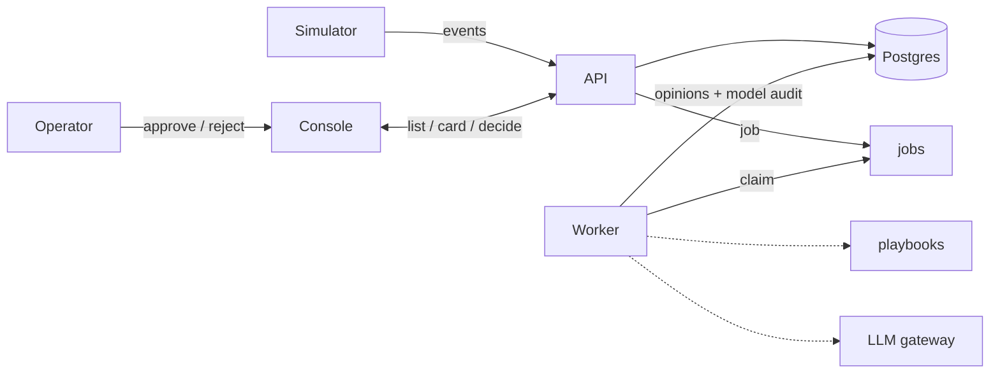

# Smart City OS

An operations desk for urban traffic: ingest → case → proposal → human decision → audit. The north star is a full city platform; this repo grows toward that in stages.

Traffic samples arrive on one segment (crash-drop, speeding, jam). A code rule may open a **case** and the system can propose a **drone look**. An operator approves or rejects; the decision is recorded. Drone flight here is case state only — no vehicle or fleet integration.

## Loop

Ingest stays on the API path and never waits on the model. The worker fills dispatcher and critic opinions asynchronously. Only the operator can change drone status; that write and the decision audit stay in application code.

## Horizons

Same loop, three depths. Details in [`docs/scope/`](docs/scope/README.md).

| | Doc | Meaning |
|---|-----|---------|
| 01 | [MVP](docs/scope/01-mvp.md) | Smallest thing that runs |
| 02 | [v1](docs/scope/02-v1.md) | First real shape, still one repo |
| 03 | [North star](docs/scope/03-north-star.md) | Large high-load platform — orientation, not a sprint |

Build in that order. Do not implement the north star as a bundle.

## Stack

Python, FastAPI, PostgreSQL, one LLM gateway, a job worker in the same app package, a thin console, a simulator script. Docker Compose for `up`.

The model may draft opinions; only application code after human confirm updates drone status. Ingest does not wait on the model.

## Development

How to run locally: [`docs/dev.md`](docs/dev.md).

## Status

MVP (U1–U7) is done — see [`docs/plans/01-mvp.md`](docs/plans/01-mvp.md).

Current cut: **v1 duty desk** (V1-U1–V1-U7). Progress lives in [`.compound-engineering/artifacts/plans/2026-09-16-001-feat-v1-duty-desk-cut-plan.md`](.compound-engineering/artifacts/plans/2026-09-16-001-feat-v1-duty-desk-cut-plan.md) — do not duplicate the table here.

[GitHub Issues](https://github.com/happylolonly/smart-city-os/issues) are an index of large tasks and named units. Parent cut: [#1](https://github.com/happylolonly/smart-city-os/issues/1); which units already have a ticket is in that plan’s Issues table. The contract and status stay in [`docs/`](docs/README.md) and the active plan. An issue is a pointer, not a second spec.

## Docs

- [docs/README.md](docs/README.md)
- [docs/scope/](docs/scope/README.md)
- [docs/dev.md](docs/dev.md)
