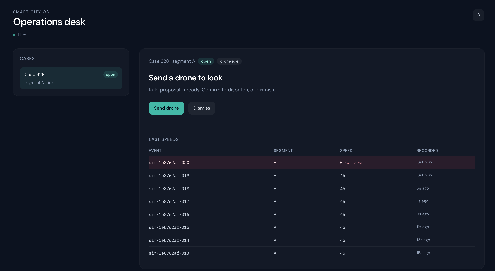
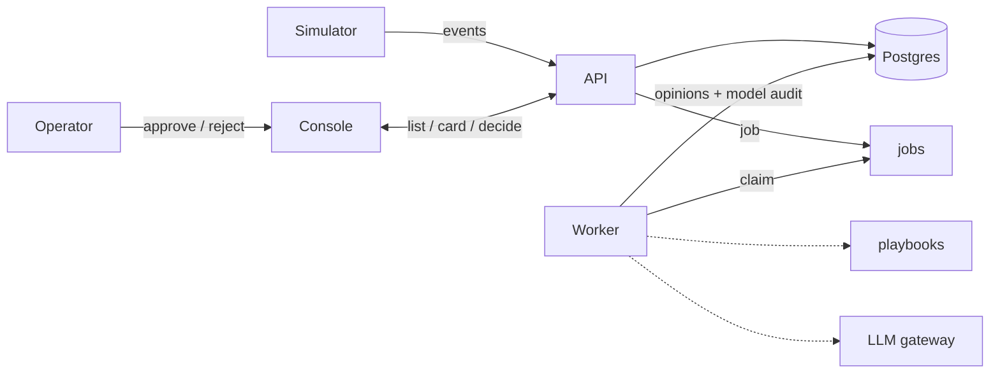

# Smart City OS

An operations desk for urban traffic: **ingest → case → proposal → human decision → audit**.

A serious slice of govtech — and a way to practice complex backend / AI patterns in one loop. Not a chat demo, not a product launch.

Traffic samples arrive on one segment (crash-drop, speeding, jam). A code rule may open a **case**; the system can propose a **drone look**. An operator approves or rejects; the decision is recorded. Drone flight here is case state only — no vehicle or fleet integration.

## Demo

Setup, then **`make demo`** (migrate → api + worker + web → live sim until **`make stop`**). Details: [`docs/dev.md`](docs/dev.md).

## What this demonstrates

- Idempotent event ingest that does not wait on the model
- Async jobs for dispatcher / critic opinions
- Case state machine; tool allowlist — agent proposes, only the operator changes drone status
- Modular monolith (folders that could become services later)
- Audit as data (operator decisions + model/tool calls), not stdout

## Loop

## Stack

Python / FastAPI / LangGraph · React (Vite) · PostgreSQL · Compose.  
Details: [`docs/stack.md`](docs/stack.md). Decisions: [`docs/adr/`](docs/adr/README.md).

## Horizons

Same loop, three depths. Details in [`docs/scope/`](docs/scope/README.md).

| | Doc | Meaning |
|---|-----|---------|
| 01 | [MVP](docs/scope/01-mvp.md) | Smallest thing that runs — **done** |
| 02 | [v1](docs/scope/02-v1.md) | First real shape, still one repo — **current** |
| 03 | [North star](docs/scope/03-north-star.md) | Large high-load platform — orientation, not a sprint |

## Status

MVP (U1–U7) done. First v1 duty desk (V1-U1–V1-U7) done. Current cut: **live shift desk**. Progress: [plan](.compound-engineering/artifacts/plans/2026-09-21-001-feat-live-shift-desk-plan.md). Issues: [cheslav-zhur/smart-city-os](https://github.com/cheslav-zhur/smart-city-os/issues) (pointers; contract stays in `docs/`).

## Not in this cut

Kafka · microservices · multi-domain sensors · digital twin / map · drone fleet · citizen app · PostGIS.

If events/day blow up first: split ingest, move jobs off the Postgres table, keep the HITL write-path thin. Not coded as a bundle upfront.

## Docs

- [docs/README.md](docs/README.md) — map of scope / ADR / plans
- [docs/stack.md](docs/stack.md) — tech inventory
- [docs/dev.md](docs/dev.md) — run locally
- [docs/scope/](docs/scope/README.md) — what we are building
