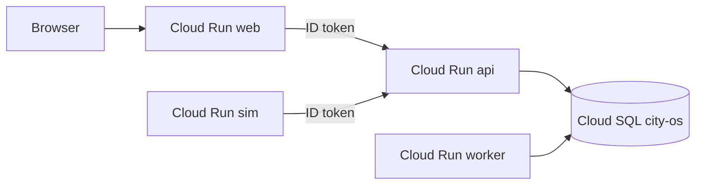

# Hosted desk (GCP)

How **web** + **api** + **worker** + **live sim** are deployed. Local desk stays [`dev.md`](dev.md) (`make demo`). No ADR for this path yet.

Parent tracker: GitHub [#12](https://github.com/cheslav-zhur/smart-city-os/issues/12).

This is a **hosted live shift shell**: public `web`, private `api`, always-on `worker` (no LLM key yet → empty opinions), always-on `sim` posting unique incidents with a Cloud Run ID token.

## What is hosted

| Piece | Now | Later |
|-------|-----|--------|
| `web` | Cloud Run, public URL; Caddy + token proxy → api | same |
| `api` | Cloud Run, **private** (compute SA invoker: web proxy + sim) | same |
| `worker` | Cloud Run, same `desk/api` image, `python -m app.worker`, **private**, `min-instances=1`, CPU always on | optional `LLM_API_KEY` secret |
| `sim` | Cloud Run, `desk/sim` image, `python run.py --live`, **private**, `min-instances=1`, CPU always on; `CITY_API_URL` + `CITY_API_ID_TOKEN=1` | same |
| Postgres | Cloud SQL `city-os` (Enterprise, `db-f1-micro`, `asia-southeast1`) | same |

## Project

| | |
|---|---|
| Project | `city-os-509403` (`city-os`) |
| Region | `asia-southeast1` (Singapore) |
| Artifact Registry | `desk` |
| Cloud Run | `web` (public), `api` + `worker` + `sim` (private) |
| Cloud SQL | `city-os` (connection `city-os-509403:asia-southeast1:city-os`) |
| DB role | `city` (same name as local) |
| Secrets | `city-os-db-password`, `city-os-database-url` (full URL for Run; do not put in git or chat) |

Images: `asia-southeast1-docker.pkg.dev/city-os-509403/desk/{web,api,sim}:<sha>` (`worker` reuses `api`).

## How `main` deploys

Push to `main` → Cloud Build (`cloudbuild.yaml`) → build/push `web` + `api` + `sim` → migrate → deploy `api` → deploy `worker` + `sim` + `web` (web/sim get the api URL).



Caddy serves Vite `dist` and strips `/api` toward a local **token proxy**, which attaches a Cloud Run identity token and forwards to private `api`. Sim posts `/events` the same way (metadata ID token when `CITY_API_ID_TOKEN` is set). Worker claims Postgres jobs. When `PORT` is set (Cloud Run), worker and sim also serve stdlib `/health`; local `make worker` / `make sim` leave `PORT` unset.

## One-time (empty project)

APIs already enabled on this project: Run, SQL, Artifact Registry, Cloud Build, Secret Manager, Compute.

```bash
gcloud config set project city-os-509403

gcloud artifacts repositories create desk \
  --repository-format=docker \
  --location=asia-southeast1 \
  --description="Desk container images"

# Cloud Build SA needs push + Cloud Run deploy (replace PROJECT_NUMBER).
PROJECT_NUMBER="$(gcloud projects describe city-os-509403 --format='value(projectNumber)')"
RUNTIME_SA="${PROJECT_NUMBER}-compute@developer.gserviceaccount.com"
CLOUDBUILD_SA="${PROJECT_NUMBER}@cloudbuild.gserviceaccount.com"

gcloud projects add-iam-policy-binding city-os-509403 \
  --member="serviceAccount:${CLOUDBUILD_SA}" \
  --role=roles/run.admin
gcloud projects add-iam-policy-binding city-os-509403 \
  --member="serviceAccount:${CLOUDBUILD_SA}" \
  --role=roles/artifactregistry.writer
gcloud iam service-accounts add-iam-policy-binding "${RUNTIME_SA}" \
  --member="serviceAccount:${CLOUDBUILD_SA}" \
  --role=roles/iam.serviceAccountUser

# Runtime needs Cloud SQL + secrets; Build SA needs to run jobs / read secrets for migrate.
gcloud projects add-iam-policy-binding city-os-509403 \
  --member="serviceAccount:${RUNTIME_SA}" \
  --role=roles/cloudsql.client
gcloud secrets add-iam-policy-binding city-os-database-url \
  --member="serviceAccount:${RUNTIME_SA}" \
  --role=roles/secretmanager.secretAccessor
gcloud secrets add-iam-policy-binding city-os-database-url \
  --member="serviceAccount:${CLOUDBUILD_SA}" \
  --role=roles/secretmanager.secretAccessor

# App DB role (password from city-os-db-password) + DATABASE_URL secret with Unix socket host.
# Also: ALTER DATABASE city OWNER TO city; (once, as postgres)
```

2nd-gen GitHub connection + trigger `web-main` (name kept; builds web, api, worker, **and** sim):

```bash
gcloud builds connections create github github \
  --project=city-os-509403 \
  --region=asia-southeast1
# Follow the printed OAuth URL; wait until installationState.stage is COMPLETE.

gcloud builds repositories create smart-city-os \
  --remote-uri=https://github.com/cheslav-zhur/smart-city-os.git \
  --connection=github \
  --region=asia-southeast1 \
  --project=city-os-509403

gcloud builds triggers create github \
  --name=web-main \
  --repository=projects/city-os-509403/locations/asia-southeast1/connections/github/repositories/smart-city-os \
  --branch-pattern='^main$' \
  --build-config=cloudbuild.yaml \
  --region=asia-southeast1 \
  --project=city-os-509403 \
  --service-account=projects/city-os-509403/serviceAccounts/174386330501-compute@developer.gserviceaccount.com \
  --include-logs-with-status
```

Manual deploy:

```bash
gcloud builds submit --config=cloudbuild.yaml --project=city-os-509403
```

## After deploy

Console URL: Cloud Run → `web` → URL. `/api/*` goes to private `api` via the token proxy. Sim keeps posting unique incidents; worker fills empty opinions until an LLM secret is wired.

## Spend

Cloud SQL `city-os` bills while the instance exists, even with no traffic. Cloud Run `web`/`api` without `min-instances` are near-zero idle. **`worker` and `sim` keep `min-instances=1` + always-on CPU** — steady cost while the hosted shift is up. Stop SQL (and scale worker/sim to zero or delete those services) when not needed:

```bash
gcloud sql instances patch city-os --activation-policy=NEVER --project=city-os-509403
```

Start again: `--activation-policy=ALWAYS`.
