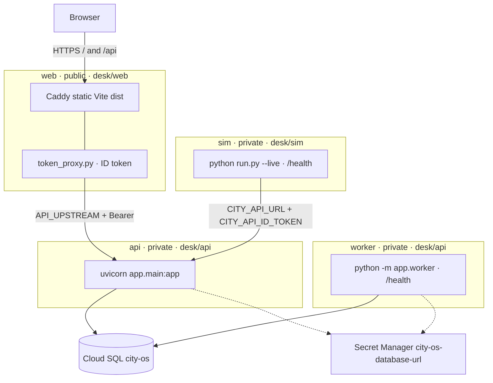

# Hosted desk (GCP)

**Production console:** [https://web-llohwfu5ga-as.a.run.app](https://web-llohwfu5ga-as.a.run.app)

How **web** + **api** + **worker** + **live sim** are deployed. Local desk stays [`dev.md`](dev.md) (`make demo`). No ADR for this path yet.

Parent tracker: GitHub [#12](https://github.com/cheslav-zhur/smart-city-os/issues/12).

This is a **hosted live shift shell**: public `web`, private `api`, always-on `worker` (no LLM key yet → empty opinions), always-on `sim` posting unique incidents with a Cloud Run ID token.

## What is hosted

| Piece | Now | Later |
|-------|-----|--------|
| `web` | Cloud Run, public URL; Caddy + token proxy → api | same |
| `api` | Cloud Run, **private** (compute SA invoker: web proxy + sim) | same |
| `worker` | Cloud Run, same `desk/api` image, `python -m app.worker`, **private**, `min-instances=1`, CPU always on | optional `LLM_API_KEY` secret |
| `sim` | Cloud Run, `desk/sim` image, `python run.py --live`, **private**, `min-instances=1`, CPU always on; `CITY_API_URL` + `CITY_API_ID_TOKEN=1` | same |
| Postgres | Cloud SQL `city-os` (Enterprise, `db-f1-micro`, `asia-southeast1`) | same |

## Project

| | |
|---|---|
| Project | `city-os-509403` (`city-os`) |
| Region | `asia-southeast1` (Singapore) |
| Artifact Registry | `desk` |
| Cloud Run | `web` (public), `api` + `worker` + `sim` (private) |
| Cloud SQL | `city-os` (connection `city-os-509403:asia-southeast1:city-os`) |
| DB role | `city` (same name as local) |
| Secrets | `city-os-db-password`, `city-os-database-url` (full URL for Run; do not put in git or chat) |

Images: `asia-southeast1-docker.pkg.dev/city-os-509403/desk/{web,api,sim}:<sha>` (`worker` reuses `api`).

## How `main` deploys

Push to `main` → Cloud Build (`cloudbuild.yaml`) → build/push `web` + `api` + `sim` → migrate → deploy `api` → deploy `worker` + `sim` + `web` (web/sim get the api URL).



| Service | Image | Process | Auth / scale | Talks to |
|---------|-------|---------|--------------|----------|
| `web` | `desk/web` | Caddy + `token_proxy` | `allUsers`; scale-to-zero ok | private `api` via ID token |
| `api` | `desk/api` | `uvicorn` | private; compute SA has `run.invoker` | Cloud SQL + `DATABASE_URL` secret |
| `worker` | `desk/api` (same) | `python -m app.worker` | private; `min-instances=1`, CPU always on | same DB (claims jobs) |
| `sim` | `desk/sim` | `python run.py --live` | private; `min-instances=1`, CPU always on | private `api` `/events` via ID token |

Caddy keeps the browser on one origin (`/api` stripped). Local `make worker` / `make sim` leave `PORT` unset (no `/health`); Cloud Run sets `PORT` so probes pass.

## One-time (empty project)

APIs already enabled on this project: Run, SQL, Artifact Registry, Cloud Build, Secret Manager, Compute.

```bash
gcloud config set project city-os-509403

gcloud artifacts repositories create desk \
  --repository-format=docker \
  --location=asia-southeast1 \
  --description="Desk container images"

# Cloud Build SA needs push + Cloud Run deploy (replace PROJECT_NUMBER).
PROJECT_NUMBER="$(gcloud projects describe city-os-509403 --format='value(projectNumber)')"
RUNTIME_SA="${PROJECT_NUMBER}-compute@developer.gserviceaccount.com"
CLOUDBUILD_SA="${PROJECT_NUMBER}@cloudbuild.gserviceaccount.com"

gcloud projects add-iam-policy-binding city-os-509403 \
  --member="serviceAccount:${CLOUDBUILD_SA}" \
  --role=roles/run.admin
gcloud projects add-iam-policy-binding city-os-509403 \
  --member="serviceAccount:${CLOUDBUILD_SA}" \
  --role=roles/artifactregistry.writer
gcloud iam service-accounts add-iam-policy-binding "${RUNTIME_SA}" \
  --member="serviceAccount:${CLOUDBUILD_SA}" \
  --role=roles/iam.serviceAccountUser

# Runtime needs Cloud SQL + secrets; Build SA needs to run jobs / read secrets for migrate.
# Trigger runs as RUNTIME_SA, so it also needs run.admin to set invoker IAM on api/web.
gcloud projects add-iam-policy-binding city-os-509403 \
  --member="serviceAccount:${RUNTIME_SA}" \
  --role=roles/cloudsql.client
gcloud projects add-iam-policy-binding city-os-509403 \
  --member="serviceAccount:${RUNTIME_SA}" \
  --role=roles/run.admin
gcloud secrets add-iam-policy-binding city-os-database-url \
  --member="serviceAccount:${RUNTIME_SA}" \
  --role=roles/secretmanager.secretAccessor
gcloud secrets add-iam-policy-binding city-os-database-url \
  --member="serviceAccount:${CLOUDBUILD_SA}" \
  --role=roles/secretmanager.secretAccessor

# App DB role (password from city-os-db-password) + DATABASE_URL secret with Unix socket host.
# Also: ALTER DATABASE city OWNER TO city; (once, as postgres)
```

2nd-gen GitHub connection + trigger `web-main` (name kept; builds web, api, worker, **and** sim):

```bash
gcloud builds connections create github github \
  --project=city-os-509403 \
  --region=asia-southeast1
# Follow the printed OAuth URL; wait until installationState.stage is COMPLETE.

gcloud builds repositories create smart-city-os \
  --remote-uri=https://github.com/cheslav-zhur/smart-city-os.git \
  --connection=github \
  --region=asia-southeast1 \
  --project=city-os-509403

gcloud builds triggers create github \
  --name=web-main \
  --repository=projects/city-os-509403/locations/asia-southeast1/connections/github/repositories/smart-city-os \
  --branch-pattern='^main$' \
  --build-config=cloudbuild.yaml \
  --region=asia-southeast1 \
  --project=city-os-509403 \
  --service-account=projects/city-os-509403/serviceAccounts/174386330501-compute@developer.gserviceaccount.com \
  --include-logs-with-status \
  --included-files='apps/**,cloudbuild.yaml'
```

Trigger only runs when a push to `main` touches `apps/**` or `cloudbuild.yaml` (docs-only commits do not redeploy). Force a full deploy anytime with `gcloud builds submit` or `gcloud builds triggers run web-main --branch=main`.

Manual deploy:

```bash
gcloud builds submit --config=cloudbuild.yaml --project=city-os-509403
```

## Build graph and caches (future)

**Parallel today.** `build-web` / `build-api` / `build-sim` start together (`waitFor: ["-"]` on api/sim). After migrate+deploy api, `deploy-worker` / `deploy-sim` / `deploy-web` run in parallel. Do not parallelize migrate with deploy api — schema must land first.

**Module caches: none in Cloud Build yet.** No remote pnpm/pip store, no Kaniko, no `--cache-from`, no BuildKit cache mounts in `cloudbuild.yaml`. Local Compose named volumes do not apply here.

What Docker layer cache can still help (only when the builder reuses layers):

| Image | Today | Later if builds feel slow |
|-------|--------|---------------------------|
| `web` | `package.json` + lock copied before `pnpm install` — lock-stable layers may hit | BuildKit `RUN --mount=type=cache` for the pnpm store; `--cache-from …/web:latest` |
| `api` | `COPY app` before `pip install` — any code change busts pip; `--no-cache-dir` | Copy only `pyproject.toml` → install → then `app`; BuildKit pip cache; `--cache-from …/api:latest` |
| `sim` | stdlib only — nothing to cache | — |

Optional speed (cost): `options.machineType` (e.g. `E2_HIGHCPU_8`) — faster CPUs, not a dependency cache.

## After deploy

| Service | URL | Notes |
|---------|-----|--------|
| `web` | https://web-llohwfu5ga-as.a.run.app | Public console (`allUsers`) |
| `api` | https://api-llohwfu5ga-as.a.run.app | Private — browser uses `/api` on `web` |
| `worker` | https://worker-llohwfu5ga-as.a.run.app | Private; `/health` only |
| `sim` | https://sim-llohwfu5ga-as.a.run.app | Private; `/health` only |

`/api/*` on `web` goes to private `api` via the token proxy. Sim keeps posting unique incidents; worker fills empty opinions until an LLM secret is wired.

## Spend

Cloud SQL `city-os` bills while the instance exists, even with no traffic. Cloud Run `web`/`api` without `min-instances` are near-zero idle. **`worker` and `sim` keep `min-instances=1` + always-on CPU** — steady cost while the hosted shift is up. Stop SQL (and scale worker/sim to zero or delete those services) when not needed:

```bash
gcloud sql instances patch city-os --activation-policy=NEVER --project=city-os-509403
```

Start again: `--activation-policy=ALWAYS`.
