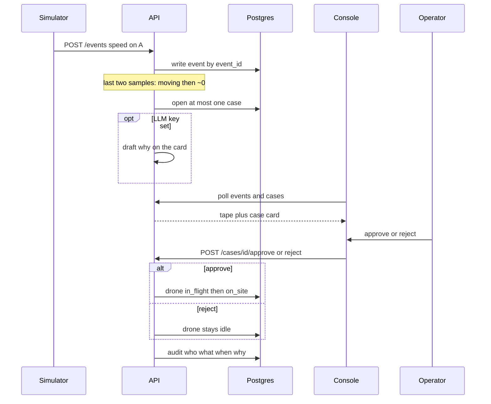
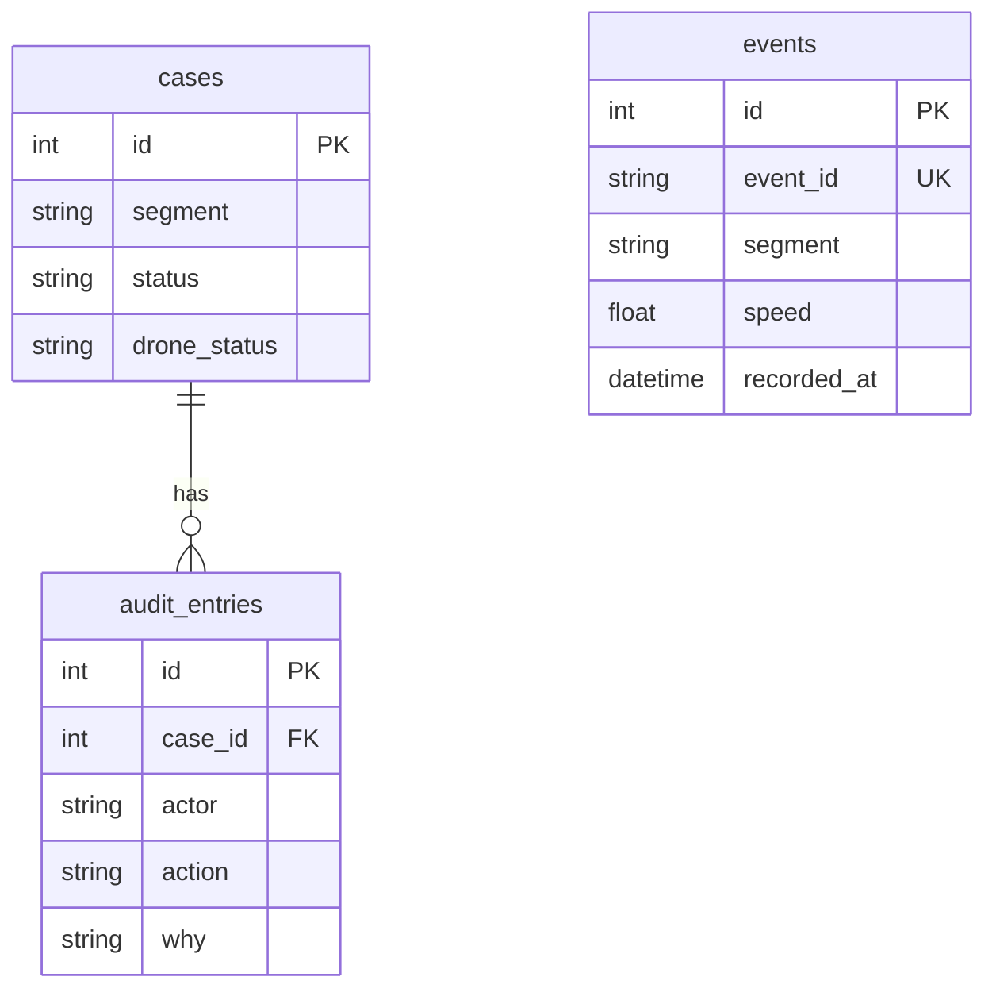

# MVP

The smallest runnable loop. If this does not work, nothing else matters.

## What it is

One road segment. A script sends **speed**. A sudden drop to zero opens a **case** (possible crash). The console shows a proposal: **send a drone to look**. An operator confirms or rejects. The drone is a status in the database (`idle` / `in_flight` / `on_site`), not hardware.

Done means: `clone → up → simulator → card → yes/no → audit row`.

## Loop

This diagram is the **MVP** shape: optional draft on the ingest path. In v1 the model runs in a worker after a job enqueue — ingest never waits on the LLM. See the [repo README](../../README.md) loop and [02-v1.md](02-v1.md).

Events are not foreign-keyed to cases: a code rule opens a case from recent speeds.

## Domain

In:

- One segment (A).
- Speed samples.
- One case type: suspected crash.

Out:

- Map, heat, resident apps, speeding, congestion, extra districts.

## Behavior

1. Docker Compose: app + Postgres.
2. Simulator posts events to the API.
3. A **code rule** opens a case on a speed collapse. This works with no model key.
4. Optional thin model pass: a short reason and a drone proposal on the card.
5. Model tools: read recent events for the segment; write a draft proposal. No `fly()`.
6. After yes, **application code** changes drone status.
7. Audit: who (demo operator from env), what, when, a short why.
8. One screen: case list, card, two buttons. Not a chat.

## Stack

Python, FastAPI, PostgreSQL (events, cases, audit), one LLM gateway (key in `.env`), a thin console, a simulator script.

No Redis, Kafka, microservices, map, vector database, extra agents, or SSO.

## AI

Rule decides that a fact is worth a case. Model may phrase a proposal. A human gates the flight.

Rungs in play: one LLM call, a feature on a normal screen, thin tool calling, human-in-the-loop.

Not in play: RAG, multi-agent, a job orchestrator, autonomy.

## Backend

One process, folders for events / cases / audit. Ingest is idempotent on `event_id`. Case status: `open` → `approved` | `rejected`.

No work queue, outbox, or sagas yet.

## After this

Do not add a city. Grow the same objects in [02-v1.md](02-v1.md).
